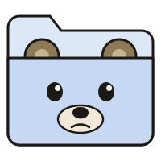
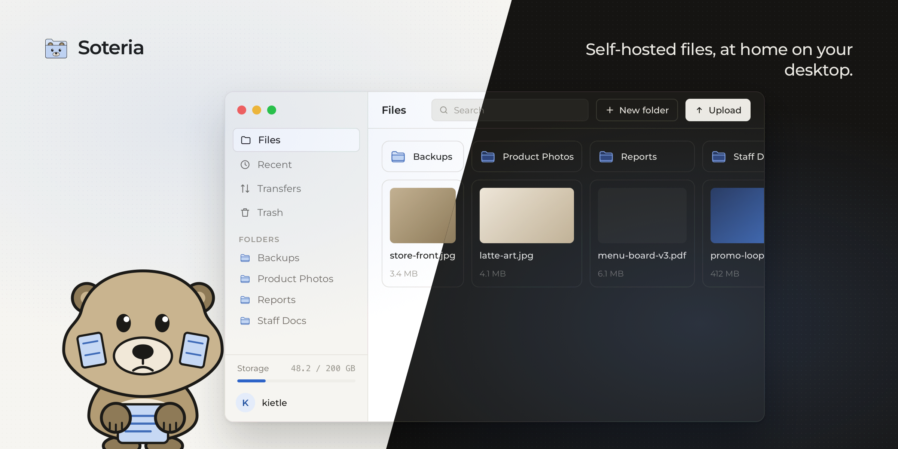
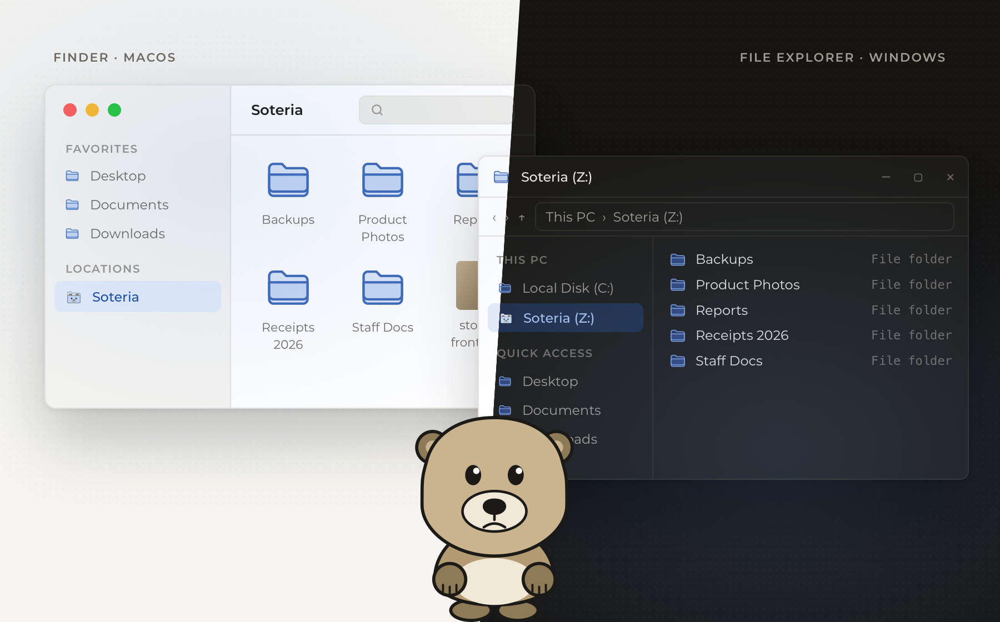
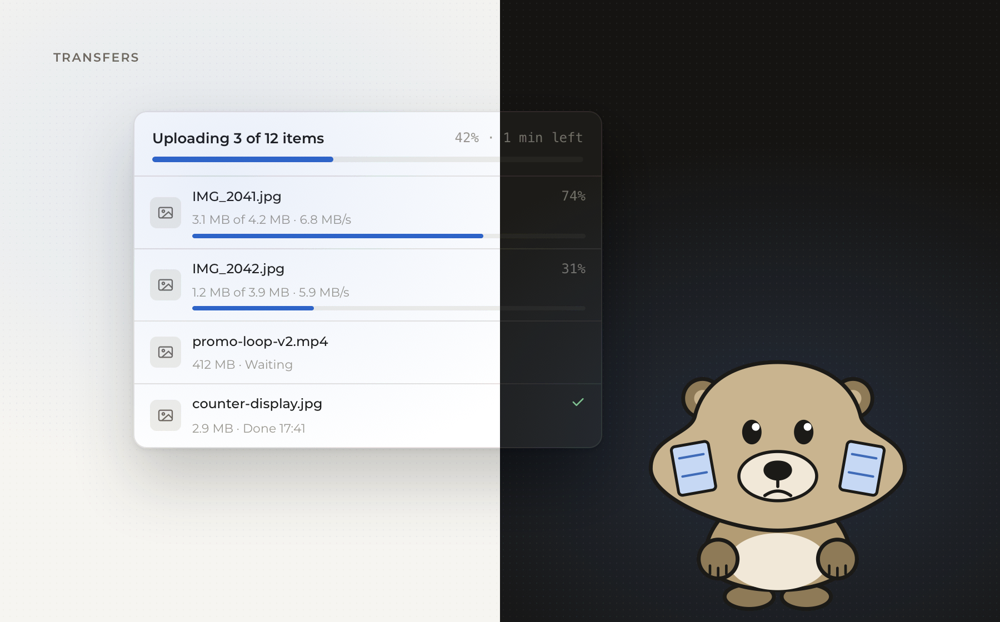
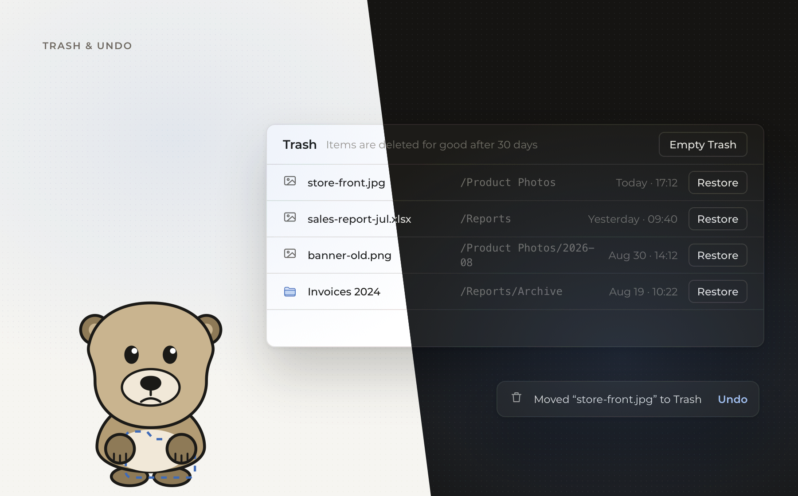
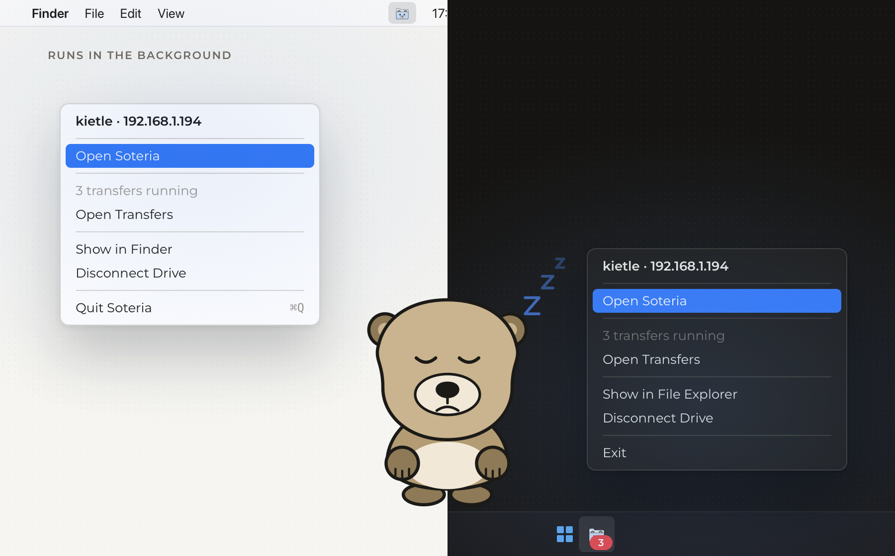

<p align="center">
  
</p>

<h1 align="center">Soteria</h1>

<p align="center">
  A native desktop client for your self-hosted WebDAV storage.<br>
  Your files, kept safe and close at hand on macOS and Windows.
</p>

<p align="center">
  <a href="LICENSE"></a>
  <a href="https://github.com/zenkiet/soteria/releases"></a>
  
  <a href="https://wails.io"></a>
  <a href="https://go.dev"></a>
  <a href="https://svelte.dev"></a>
  <a href="#contributing"></a>
</p>

<p align="center">
  
</p>

<p align="center">
  <a href="#why-soteria">Why</a> ·
  <a href="#what-you-get">Features</a> ·
  <a href="#download">Download</a> ·
  <a href="#works-with">Servers</a> ·
  <a href="#privacy">Privacy</a> ·
  <a href="#roadmap">Roadmap</a> ·
  <a href="#contributing">Contributing</a>
</p>

<br>

## Why Soteria

Running your own storage is the easy part. Living with it every day is not.

Browser uploads die when the tab closes. "Connect to Server" in Finder asks for a password again, then hangs. One wrong click deletes a file for good, because WebDAV has no trash. A big upload stops halfway when the laptop sleeps, and nothing tells you.

Soteria is the desktop app that turns a WebDAV server into something that feels like a folder on your own computer. It connects once, remembers the login securely, shows the server inside Finder and File Explorer, keeps transfers going until they finish, and puts a trash between you and your mistakes.

The name comes from the Greek spirit of safety and deliverance. That is the whole job: your files, kept safe.

## What you get

<table>
  <tr>
    <td width="50%" valign="top">
      
      <p><strong>Your server, as a drive.</strong><br>One switch adds <em>Soteria</em> to the Finder sidebar and to This PC. Every app on your machine can open and save there. No extra software on macOS; on Windows the driver is installed for you on request.</p>
    </td>
    <td width="50%" valign="top">
      
      <p><strong>Transfers that finish.</strong><br>Drop files or whole folders. Soteria queues them, shows speed and time left, retries when the network hiccups, and counts the running transfers on the Dock and taskbar icon.</p>
    </td>
  </tr>
  <tr>
    <td width="50%" valign="top">
      
      <p><strong>A trash for the cloud.</strong><br>Deleting moves items into a trash folder on the server. Restore them from the Trash page, undo straight from the toast, and let Soteria clear anything older than thirty days.</p>
    </td>
    <td width="50%" valign="top">
      
      <p><strong>Quietly in the background.</strong><br>Close the window and Soteria keeps the drive connected from the menu bar or system tray. It tells you once when a queue finishes and asks before quitting with work still running.</p>
    </td>
  </tr>
</table>

And the everyday details:

- **Search everything.** Type a name and get results from the whole server, not just the current folder.
- **Previews and thumbnails.** Images, PDFs, video, audio, text and Word documents open in place. Card view shows real thumbnails.
- **Copy, move, duplicate, rename.** With conflict handling that asks instead of overwriting.
- **Keyboard first.** Arrow keys, Space to preview, standard shortcuts for copy, paste, new folder, refresh and select all.
- **Two themes, two platforms.** Light and dark follow the system or your choice. Native window controls on macOS and Windows.
- **Storage at a glance.** The sidebar shows how much of your quota is used and warns when it runs low.

## Download

Soteria is in active development. Builds for each release are on the [Releases](https://github.com/zenkiet/soteria/releases) page.

| Platform | Package | Notes |
| --- | --- | --- |
| macOS 12 or later, Apple silicon | `Soteria-<version>-macOS-apple-silicon.dmg` | The network drive uses what already ships with macOS. |
| macOS 12 or later, Intel | `Soteria-<version>-macOS-intel.dmg` | Same app, built for Intel Macs. |
| Windows 10 and 11, x64 | `Soteria-<version>-Windows-x64-Setup.exe` or the portable `.zip` | The network drive needs [WinFsp](https://winfsp.dev); Soteria offers to install it the first time you turn the drive on. |

First run: choose **Add server**, enter the WebDAV address, your username and password, and tick **Remember me** to keep the password in the macOS Keychain or the Windows credential store.

## Works with

Soteria speaks plain WebDAV, so it works with any server that does. It is developed and tested against [SFTPGo](https://github.com/drakkan/sftpgo). Nextcloud, ownCloud, Apache and nginx WebDAV modules are expected to work; reports and fixes are welcome.

Storage quota is shown whenever the server reports it; with SFTPGo the numbers come straight from its own accounting.

## Privacy

- Your files travel directly between your computer and your server. There is no relay and no account with us.
- Passwords live in the macOS Keychain or the Windows credential store, never in a plain file.
- Soteria collects no analytics and makes no network requests other than to the server you configured.

## Roadmap

Planned, in rough order:

- Share links for servers that support them
- Pinned folders in the sidebar
- Trash for files deleted through the network drive
- Automatic updates
- Linux

Ideas and votes belong in [Issues](https://github.com/zenkiet/soteria/issues).

## Building from source

Soteria is built with [Wails v3](https://wails.io), Go and SvelteKit.

```bash
git clone https://github.com/zenkiet/soteria.git soteria
cd soteria/frontend && pnpm install && cd ..
wails3 dev
```

You need Go 1.25, Node 26 with pnpm, and the `wails3` CLI. `wails3 package` produces the installers.

## Contributing

Bug reports, feature requests and pull requests are welcome. Please open an issue before starting large changes so the design can be agreed first; every user-facing change in Soteria starts as a mockup.

## License

Soteria is free software, released under the [Apache-2.0](LICENSE).

## Acknowledgements

[Wails](https://wails.io), [Svelte](https://svelte.dev), [WinFsp](https://winfsp.dev) and [SFTPGo](https://github.com/drakkan/sftpgo) make Soteria possible. The gopher is Bo, Soteria's mascot; his cheek pouches fill up as the transfer queue does.

<p align="center"><sub>© 2026 ZenSoftware. All rights reserved.</sub></p>
